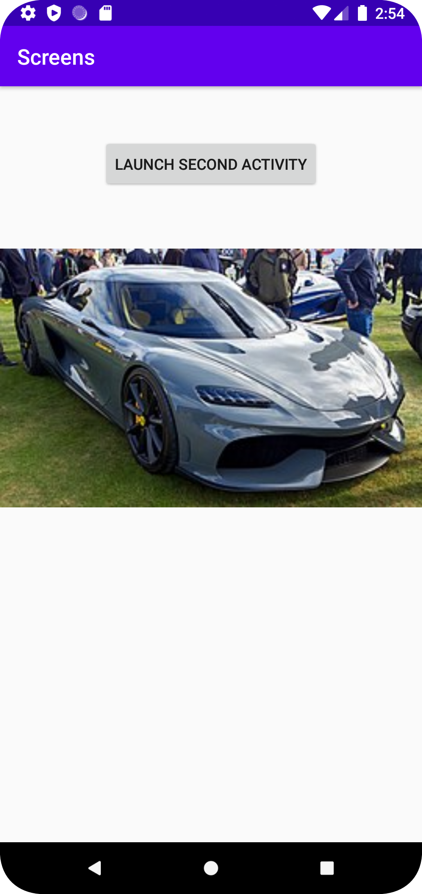
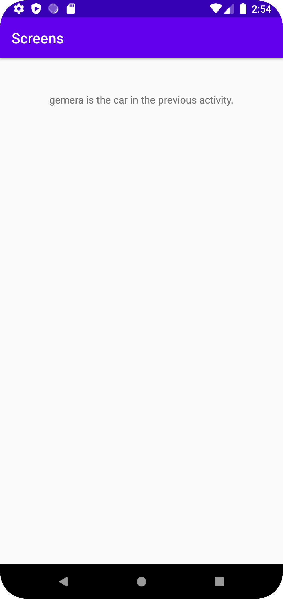

# Rapport

I denna uppgift skapades en andra activity dit data skulle skickas från main activity via intents och bundles. Main activity innehåller en bild på en Koenigsegg Gemera och en knapp
som tar en vidare till den andra activityn. Den informationen som skickas via intent är textsträngen "gemera" som sedan skrivs ut i en TextView i den andra activityn.


Koden för Main activity ser ut som nedan. Activityn består utav en imageView som helt enkelt innehåller en bild. Sedan har activityn en Button som har en listener
som callar funktionen onButtonClick(). Där skapas ett intent till den andra activityn och startar den activityn.
```
  ImageView imageView;
    Button button;

    @Override
    protected void onCreate(Bundle savedInstanceState) {
        super.onCreate(savedInstanceState);
        setContentView(R.layout.activity_main);

        button = findViewById(R.id.button);
        button.setOnClickListener(new View.OnClickListener() {
            @Override
            public void onClick(View v) {
                   onButtonClick();
            }
        }
        );

        imageView = findViewById(R.id.gemera);
    }

    private void onButtonClick(){
        Intent intent = new Intent(this, SecondActivity.class);
        intent.putExtra(getString(R.string.Car_name_gemera), getString(R.string.Car_picture_value_gemera));
        startActivity(intent);
    }
```

Den andra activityn hämtar intentet och skriver ut värdet från intentet i en textView.

```
 Intent intent;
    TextView textView;

    @Override
    protected void onCreate(Bundle savedInstanceState) {
        super.onCreate(savedInstanceState);
        setContentView(R.layout.activity_second);

        intent = getIntent();
        textView = findViewById(R.id.secondActivityTextView);
        String carName = intent.getStringExtra("Gemera") + " is the car in the previous activity.";
        textView.setText(carName);

```

Main activity:


Second activity:
